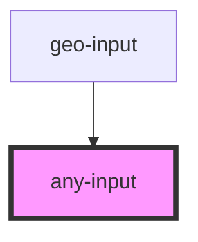

# any-input

<!-- Auto Generated Below -->

## Properties

| Property                         | Attribute             | Description | Type      | Default     |
| -------------------------------- | --------------------- | ----------- | --------- | ----------- |
| `disabled`                       | `disabled`            |             | `boolean` | `false`     |
| `letters` _(required)_           | `letters`             |             | `string`  | `undefined` |
| `targetFirstLetter` _(required)_ | `target-first-letter` |             | `string`  | `undefined` |

## Dependencies

### Used by

 - [geo-input](../geo-input)

### Graph

----------------------------------------------

*Built with [StencilJS](https://stenciljs.com/)*
